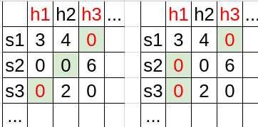

## Empirical Risk Minimization with Inductive Bias
In this section, we formal prove that we are able to avoid overfitting by
1. limiting the number of possible hypothesis and
2. by increasing the number of training data.

### Finite Hypothesis Class
* A common solution to avoid overfitting is to restrict the search space of ERM
* Formally, the learner should choose in advance (before seeing the data) a set of predictors $$ \mathcal{H}$$, called a *hypothesis class*
* For a given hypothesis class $$ \mathcal{H}$$ and a training sample $$S$$, the $$ERM_{ \mathcal{H} }$$ learner choose a predictor $$h \in \mathcal{H}$$, with the lowest possible error over $$S$$. Formally,   
$$ERM_{ \mathcal{H} }(S) \in \mathop{argmin}_{h \in \mathcal{H}} L_s(h)$$ [^1]
* By restricting the learner to choosing a predictor from $$\mathcal{H}$$, we bias it toward a particular set of predictors. Such restrictions are often called an *inductive bias*
* The restriction is determined before the learner sees the training data, it should ideally be based on some prior knowledge about the problem to be learned
* For example, for the papaya taste prediction problem we may choose the class $$\mathcal{H}$$ to be the set of predictors that are determined by axis aligned rectangles (in the space determined by the color and softness coordinates) 
* A fundamental question in learning theory is, over which hypothesis classes, will $$ERM_{ \mathcal{H}}$$ not result in overfitting
* Intuitively, choosing a more restricted hypothesis class better protects us against overfitting but at the same time might cause us a stronger inductive bias

### Derivation of Learning Ability
In the following, we will prove that we are able to avoid overfitting by having finite hypothesis claas and sufficiently large training sample. The overview of the proof is as follows:
1. We write down the probability of overfitting and set an inequality equation to upper bound on it 
2. By solving the inequality equation, we derive the number of samples required to avoid overfitting at certain confidence level

We will have two assumptions for the following derivation:
1. The Realizability Assumption: There exists $$h^* \in \mathcal{H}$$ $$s.t.$$ $$L_{\mathcal{D},f}(h^*)=0$$. That is, we can always find a hypothesis in $$ \mathcal{H}$$ such that the true error is zero. 
2. The i.i.d. Assumption: The examples in the training set are independently and identically distributed (i.i.d.) according to the distribution $$ \mathcal{D}$$. We denote this assumption by $$S\sim \mathcal{D}^m$$ [^2]

Note that the first assumptions implies $$ERM_{ \mathcal{H} }$$ can always find a hypothesis that leads to zero empirical risk. However, since there might be multiple hypothesis that leads to zero empirical risk, $$h^*$$ is not guaranteed to be selected. Therefore, we will not face underfitting (training error too high) but we are still at the risk of overfitting.

We will also utilized two lemma:
1. Union Bound: For any two sets $$A,B$$ and a distribution $$ \mathcal{D}$$ we have  
$$ \mathcal{D}(A\cup B) < \mathcal{D}(A)+ \mathcal{D}(B)$$
2. $$1+x < e^x$$, Proof:  
$$e^x = \mathop{\sum}_{n=0}^{\infty}\frac{x}{n!}=1+x+\frac{x^2}{2}+\dots \ge 1+x$$

#### Derivation of The Inequality
* $$ERM_{ \mathcal{H}}(S)$$ gives us a hypothesis $$h_S \in \mathop{argmin}_{h \in \mathcal{H}} L_s(h)$$.
* We interpret the event that the true error is greater than a certain amount as overfitting  
$$L_{ \mathcal{D},f}(h_s) > \epsilon$$
* Since $$h_s$$ depends on the training set $$S$$, which is picked by a random process, the true error is also a random variable, and the probability that overfitting happens is  
$$ \mathbb{P}[L_{ \mathcal{D},f}(h_s) > \epsilon] = \mathcal{D}^m(\{S|_x: L_{ \mathcal{D},f }(h_s)>\epsilon\})$$
* We than upper bound the probability of overfitting with a parameter $$\delta$$  
$$ \mathcal{D}^m(\{S|_x: L_{ \mathcal{D},f }(h_s)>\epsilon\})<\delta$$,
where $$S|_x=(x_1\dots, \x_m)$$ is the instances of the training set

In other words, overfitting happens when we are unlucky to get a non-representative sample that leads to great true error. What we want to do is to bound the probability of such "unluckiness" to a small value $$\delta$$.

#### Derivation of the result
To derive the upper bound of $$\mathcal{D}^m(\{S|_x: L_{ \mathcal{D},f }(h_s)>\epsilon\})$$, we first analyze the "bad sample" set $$\{S|_x: L_{ \mathcal{D},f }(h_s)>\epsilon\}$$.

In the following image, we order all hypothesis and sample sequentially. Each cell records the empirical risk $$L_S(h)$$. Though the true error is not shown, each "bad" hypothesis $$h$$ such that $$L_{ \mathcal{D},f }(h)>\epsilon$$ are highlighted in red color. The cells highlighted in light green records which hypothesis $$ERM_{ \mathcal{H} }$$ selects for each sample. Overfitting happens when a bad hypothesis is selected (text highlighted in red color).

The two table shows two possible $$ERM_{ \mathcal{H} }$$, selecting different hypothesis for each sample. For the left case, $$S_1$$ and $$S_2$$ are "bad" samples. As for the right case, all $$S_1, S_2$$ and $$S_3$$ are "bad" samples.

Clearly, the "bad" sample set $$\{S|_x: L_{ \mathcal{D},f }(h_s)>\epsilon\}$$ depends on how $$ERM_{ \mathcal{H} }$$ selects the hypothesis $$h_s$$ for each sample. However, we could see that a sample is a potential "bad" sample if one of the "bad" hypothesis achieves zero empirical risk on it. 

Formally, we define the set of "bad" hypothesis  
$$ \mathcal{H}_B = \{h \in \mathcal{H}: L_{ \mathcal{D},f }(h)>\epsilon\}$$  
and the misleading samples  
$$M = \{S|_x: \exists h \in \mathcal{H}_B, L_S(h)=0 \}$$  
It follows that, $$\{S|_x: L_{ \mathcal{D},f }(h_s)>\epsilon\} \subseteq M$$ and $$M$$ could be rewritten as:  
$$M = \mathop{\cup}_{h\in \mathcal{H}_B}\{S|_x: L_S(h)=0\}$$  
Hence, the overfitting probability is now bounded by:  
$$ \mathcal{D}^m(\{S|_x: L_{ \mathcal{D},f }(h_s)>\epsilon\})\le \mathcal{D}^m(M) = \mathcal{D}^m(\mathop{\cup}_{h\in \mathcal{H}_B}\{S|_x: L_S(h)=0\})$$  
By the union bound lemma, we have  
$$ \mathcal{D}^m(\{S|_x: L_{ \mathcal{D},f }(h_s)>\epsilon\}) \le \mathop{\sum}_{h \in \mathcal{H}_B} \mathcal{D}^m(\{S|x: L_s(h)=0\}) $$  
By the i.i.d assumption  
$$ \mathcal{D}^m(\{S|x: L_s(h)=0\}) = \mathcal{D}^m(\{S|x: \forall i, h(x_i)=f(x_i)\}) \\ = \mathop{\prod}_{i=1}^{m} \mathcal{D}(\{ x_i: h(x_i)=f(x_i)\}) $$  
For each individual sampling of an element of the training set we have  
$$ \mathcal{D}(\{ x_i: h(x_i)=f(x_i)\}) = 1-L_{( \mathcal{D},f)}(h) \le 1-\epsilon$$  
The last inequality holds bacause we are considering hypothesis $$ h \in \mathcal{H_B}$$, and each of these "bad" hypothesis satisfies that $$ L_{( \mathcal{D},f)}(h) > \epsilon $$.  
By lemma 2 ($$1+x<e^x$$), we have  
$$ {D}^m(\{S|x: L_s(h)=0\})  \le (1-\epsilon)^m \le e^{-\epsilon m}$$  
Finally, we get the upper bound of the **overfitting probability**:  
$$ \mathcal{D}^m(\{S|_x: L_{ \mathcal{D},f }(h_s)>\epsilon\})\le \mathop{\sum}_{h \in \mathcal{H}_B} \mathcal{D}^m(\{S|x: L_s(h)=0\}) \le | \mathcal{H}_B|e^{-\epsilon m} \le | \mathcal{H}|e^{-\epsilon m}$$  
To be more clear,  
$$ \mathbb{P}[overfitting] = \mathbb{P}[L_{ \mathcal{D},f}(h_s)] = \mathcal{D}^m(\{S|_x: L_{ \mathcal{D},f }(h_s)>\epsilon\}) \le | \mathcal{H}|e^{-\epsilon m}$$  
Since we want the overfitting probability be bounded by $$\delta$$, we then solve:  
$$ \delta \le | \mathcal{H}|e^{-\epsilon m} $$  
And this leads to:  
$$ m \ge \frac{log(| \mathcal{H}|/ \delta)}{\epsilon}$$

**COROLLARY 2.3**
Let $$ \mathcal{H}$$ be a finite hypothesis class. Let $$\delta\in (0,1)$$ and $$\epsilon >0$$ and let $$ m $$ be an integer that satisfies  
$$ m \ge \frac{log(| \mathcal{H}|/ \delta)}{\epsilon}$$

Then, for any labeling function, $$f$$ , and for any distribution, $$ \mathcal{D}$$ , for which the realizability assumption holds (that is, for some $$h\in \mathcal{H}, L_{( \mathcal{D},f )}(h)=0$$ holds), with probability of at least $$1-\delta$$ over the choice of an i.i.d. sample $$S$$ of size $$m$$ , we have that for every ERM hypothesis, $$h_s$$, it holds that  
$$L_{( \mathcal{D},f )}(h_s) < \epsilon$$

The preceding corollary tells us that for a sufficiently large $$m$$ , the $$ERM_{ \mathcal{H} }$$ rule over a finite hypothesis class will be *probably* (with confidence $$1-\delta$$) *approximately* (up to an error of $$\epsilon$$) correct.

###A Final Analogy

Imageine that you are hosting a company and you are hiring workers from a finite pool ($$ \mathcal{H}$$). Each of your customer will order a list of $$m$$-tasks to execute ($$m$$-tuple sample $$S$$). To complete the order, you simply choose one worker form those who make no error for all the tasks on the list (ERM).

Though things went well, one day, you just come up the the question that whether you are hiring the right person. You suspect that the worker you choose might do well for the order list, but he/she might fail on many other tasks. You feel that is unfair for those left good workers who performe well not only for the order list but also for the other tasks. 

You then remember that the machine learning theory teaches you a lesson. All you need to do is to combine several order lists into a new one such that the new one contains much more tasks. The intuition is that if the worker does not really perform well on many tasks (true error $$> \epsilon$$), as you increase the number of tasks on the list, he/she becomes less likely to make no error for tasks on the list and hence will not be chosen by you. By doing so, with a certain confidence level, you know that the workers you chose not only perform well for customer orders but they also make little error when asked to execute the other tasks. 

[^1]: There might be multiple $$h$$ leading to the minimum error on $$S$$.
[^2]: Like $$ \mathcal{D}(A)$$, $$ \mathcal{D}^m(A^m)$$ assigns a probability determining how likely it is to observe a sequence of sample belonging to the event $$A^m \subseteq \chi^m$$

